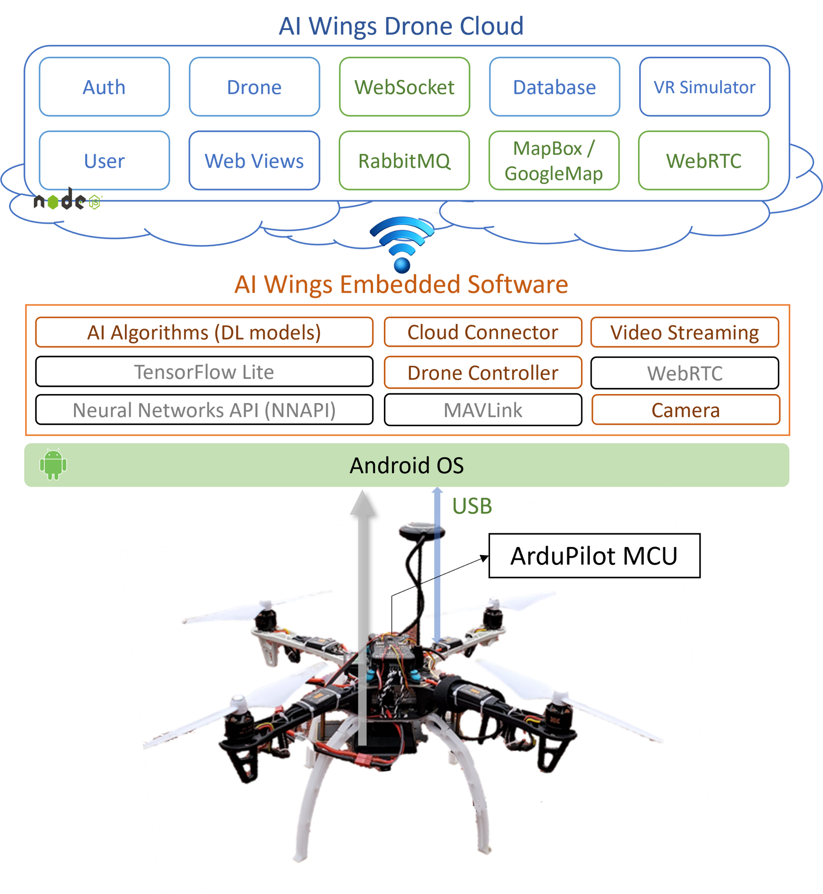

# AI Wings

AI Wings is an AIoT Drone System for commanding AIoT drone fleets via the 4G/5G network. We integrate ArduPilot with Android phones and endow DIY drones with AI computing power and 4G/5G connectiviy. AI Wings consists of a cloud server (node.js), Web UI (vue.js), onboard App (Android), and VR simulation (Unreal). Users can install our cloud server and create their own Internet of Drones. Our paper "[AI Wings: An AIoT Drone System for Commanding ArduPilot UAVs](https://ieeexplore.ieee.org/document/9836339)" has been published by IEEE Systems Journal.


## Real World Testing

All test videos in the real world can be found here: <br/>
[www.youtube.com/playlist?list=PL3S3ZnDPwJ-MV5H1yTzR0jPp5sz-ptSo3](https://www.youtube.com/playlist?list=PL3S3ZnDPwJ-MV5H1yTzR0jPp5sz-ptSo3).

AI Wings System Test | AED Delivery Test
:-----------------------------------------:|:-------------------------------------------------------:
<a href="https://www.youtube.com/watch?v=ou2W5PuoimQ"></a> | <a href="https://www.youtube.com/watch?v=jq7bbERNfHk"></a>
4G/5G Two-drones Control | VR Drone control
<a href="https://www.youtube.com/watch?v=ok3dn92Ep88"></a> | <a href="https://www.youtube.com/watch?v=v67eJAYtv8c"></a>


## Getting Started


The major steps to create your own AIoT drone fleet are:

### 1. Build Your own Drones

1. Assemble an ArduPilot-based drone. We recommend [Pixhawk AutoPilot](https://docs.px4.io/v1.9.0/en/getting_started/)

### 2. Install Onboard App
<a name="software"/>

1. Get an Android phone and install our Android control APP. Refer to our [esm-android page](onboard_app.md)
2. Connect APP to your server. (Bind your phone to the server if you are using multi-user server)
3. Attach the phone to the drone and connect it to Pixhawk MCU

### 3. Setup a Cloud Server
<a name="cloud"/>

1. Install our [cloud server](server.md).
2. Read the user's manual of [Web UI](web_ui.md)
3. Check the web UI to see if the drone appears on the map
4. Ready to fly! 


### VR Simulation

AI Wings supports Microsoft AirSim, which allows users to simulate drone functtions in VR worlds. The simulation video is shown below. The upper-left window is the VR world and lower-left window is the virtual camera view. The right window is the web UI of AI Wings.

[](https://www.youtube.com/watch?v=v67eJAYtv8c)

## Software Development

The system architecture is shown as below.



This project is under active development and will be updated frequently.

## Docker Deployment

If you wish to deploy the frontend and backend separately on different computers, please refer to `aiwings/api-server/docker_backend-deployment/` for backend deployment and `aiwings/web_ui/docker_front-deployment/` for frontend deployment.

### Applicable scenario for this document

- Want to **install the frontend and backend applications of aiwings on the same computer**.
- This document will provide comprehensive instructions for the one-time deployment of both the frontend and backend of aiwings, including the installation of RabbitMQ and MySQL required for the backend.
- Regardless of whether RabbitMQ and MySQL are already installed, you can follow the instructions below for the operation.

### Pre-installation preparations

- Install [Docker](https://www.docker.com/get-started/) on your computer.

- If you haven't and wish to install RabbitMQ or MySQL on the same computer as the backend application:

  - If RabbitMQ is not yet installed, please ensure that ports `15672` and `5672` are not occupied by other applications, as the RabbitMQ container will use these ports as the default ports.

  - If MySQL is not yet installed, please ensure that port `3306` is not occupied by other applications, as the MySQL container will use port 3306 as the default port.

### Document explanation

Before embarking on the Docker containerized deployment of the aiwings application, you need to configure two crucial files according to your requirements: the `.env file` and the `docker-compose.yml file.` These two files play vital roles throughout the entire deployment process.

#### `.env` file

- Rename the `.env.example` file to `.env`.

- The .env file contains environment variable settings used to configure the aiwings application. By modifying these parameter values, users can customize the backend's connection settings with RabbitMQ and MySQL, as well as configure the IP settings for the frontend.

```python
## .env default file

## """
## Parameters used to build the Docker image for the backend (2023aiotlab/api_server).
## """

## RabbitMQ connection parameters
RABBITMQ_SERVICE_SERVICE_HOST=rabbitmq_service
RABBITMQ_SERVICE_SERVICE_PORT=5672
RABBITMQ_SERVICE_USER=guest
RABBITMQ_SERVICE_PASSWORD=guest

## MySQL connection parameters
MYSQL_SERVICE_SERVICE_HOST=mysql_service
MYSQL_SERVICE_SERVICE_PORT=3306
MYSQL_SERVICE_USER=user
MYSQL_SERVICE_PASSWORD=mysql

MYSQL_ROOT_PASSWORD=password

## """
## Parameters used to build the Docker image for the frontend (2023aiotlab/web_ui).
## """
URL_FRONTEND=localhost
## URL_BACKEND=backend

## """
## Connecting a local SSL certificate to a frontend container internally.
## """
SSL_folder = './ssl/'
```

##### If not Yet Installed RabbitMQ or MySQL:
- If RabbitMQ or MySQL is not yet installed, you can set the usernames and passwords for the newly created MySQL and RabbitMQ here.

- Default usernames and passwords: 
  - RabbitMQ: guest/guest
  - MySQL: user/mysql
  - MYSQL_ROOT: root/password 

##### If you already install RabbitMQ:
- Change the value of `RABBITMQ_SERVICE_SERVICE_HOST` to your RabbitMQ server IP. (The IP don't use 127.0.0.1 or localhost)
- If the backend of your created RabbitMQ server not using default port '5672', Change the value of `RABBITMQ_SERVICE_SERVICE_PORT` to your RabbitMQ backend server port. 
- In the docker-compose.yml file, comment out the relevant settings.

##### If you already install MySQL:
- Change the value of `MYSQL_SERVICE_SERVICE_HOST` to your MySQL server IP. (The IP don't use 127.0.0.1 or localhost)
- If your created MySQL server not using default port '3306', Change the value of `MYSQL_SERVICE_SERVICE_PORT` to your MySQL server port. 
- Because not using the provided docker-compose.yml to create MySQL, you can also change `MYSQL_SERVICE_USER` and `MYSQL_SERVICE_PASSWORD` to 'root' user and its password to connect your MySQL.
- In the docker-compose.yml file, comment out the relevant settings.

##### Customize the Web IP

- You can change `URL_FRONTEND` to your IP or domain.

- Default frontend Web IP: localhost

#### `docker-compose.yml` file

- The docker-compose.yml file defines the containerized deployment configuration for the aiwings application. Through this file, you can quickly accomplish the deployment of aiwings.

##### change SSL certificate

You can change SSL certificate.

- If you are using a domain name and need to bind your domain's SSL certificate, you can do so using the following method.

- Uncomment lines 103-104 as shown below:

  ```yml
  volumes:
  - ${SSL_folder}:/etc/nginx/ssl/
  ```

  In your `.env` file, the default local SSL certificate folder is located under the relative ssl folder. Therefore, if you need to use your own SSL certificate, you must place your SSL certificate files into the `./ssl/` folder or update the SSL certificate folder path configured in the `.env` file to your SSL certificate folder path.

  - Note: Your SSL certificate folder must contain two files named `certificate.crt` and `private.key` (with matching names). These files will be mapped to the /etc/nginx/ssl/ directory inside the Nginx container.

##### If not Yet Installed RabbitMQ or MySQL:
- It can be used directly without changing anything. 

##### If you already install MySQL:
- Comment out or delete the entire mysql_service in docker-compose.yml.【line 41~56】
- Comment out or delete the **mysql_service option** in the depends_on of the backend.【Line 66】
- And change the MySQL connection parameters in the .env file.

##### If you already install RabbitMQ:
- Comment out or delete the entire rabbitmq_service in docker-compose.yml.【line 28~39】
- Comment out or delete the **rabbitmq_service option** in the depends_on of the backend.【Line 65】
- And change the MySQL connection parameters in the .env file.

### How to install

1. Open Command Prompt

2. cd to `docker-deployment/` folder

3. Run docker-compose.yml in the background with the following command. Then you can see four container in your docker desktop.

    ```
    docker-compose up -d
    ```

    

    

4. To access the web application, simply navigate to `http://<localhost, your IP, or your domain>` in your web browser.
