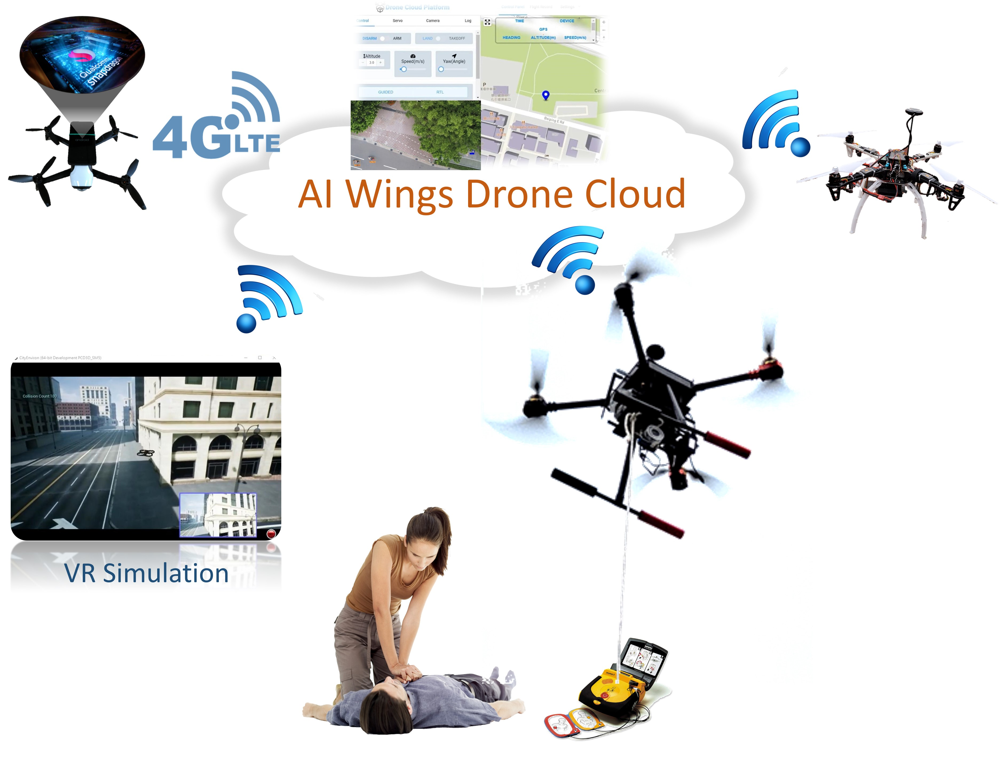

# AI Wings

AI Wings is a complete AIoT Drone System for commanding AIoT drone fleets via the 4G/5G network. We integrate ArduPilot with Android phones and endow DIY drones with AI computing power and 4G/5G connectiviy. AI Wings consists of Android embedded software cooperating with ArduPilot, a drone cloud server based on node.js and vue.js, and VR simulation in AirSim and Unreal. Users can install our cloud server and create their own Internet of Drones. Our paper "[AI Wings: An AIoT Drone System for Commanding ArduPilot UAVs](https://ieeexplore.ieee.org/document/9836339)" has been published by IEEE Systems Journal! 

# New generation UI

Ai wings now focus on updating the newer website UI, we will provide the multi-drone(multi-UAV) control through our platform.

## Test Videos

AI Wings System Test | AED Delivery Test
:-----------------------------------------:|:-------------------------------------------------------:
 | 

## Architecture

## VR Simulation

AI Wings supports Microsoft AirSim, which allows users to simulate drone functtions in VR worlds. The simulation video is shown below. The upper-left window is the VR world and lower-left window is the virtual camera view. The right window is the web UI of AI Wings.

## Getting Started

### Table of Contents 

The major steps to create your own AIoT drone fleet are:

[Drone Hardware](#hardware)  
[Embedded Software](#software)  
[Cloud Server](#cloud)

More details of each step are in the following:

### Drone Hardware
<a name="hardware"/>

1. Assemble an ArduPilot-based drone. We recommend [Pixhawk AutoPilot](https://docs.px4.io/v1.9.0/en/getting_started/)

### Embedded Software
<a name="software"/>

1. Get an Android phone and install our Android control APP. Refer to our [esm-android page](/esm-android)
2. Connect APP to your server. (Bind your phone to the server if you are using multi-user server)
3. Attach the phone to the drone and connect it to Pixhawk MCU

### Cloud Server
<a name="cloud"/>

1. Install our [cloud server](/api-server). We provide docker files.
2. Read the user's manual of Web UI (/web_ui)
3. Check the web UI to see if the drone appears on the map
4. Ready to fly! 

This project is under active development and will be updated frequently.
