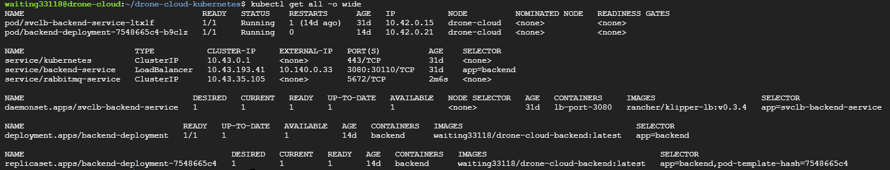

# Backend Server of Drone Cloud Platform


>This is the backend API server of [Drone Cloud Platform](https://github.com/waiting33118/drone-cloud-platform3.0), used for handle drone communication between drone's android app and the drone cloud platform.

# Project introduction

## File structure
- **Src** - The main source code
  - **Entity** - Datebase schemas
  - **Helpers** - Some helper funtions
  - **MiddleWares** - Intermediate checkpoint services
  - **Routes** - Restful API routes
  - **Services** - The main business logic
  - **Types** - TypeScript type definitions
  - **Server.ts** - Main entry point
- **Package.json** - The dependency list
- **Dockerfile** - For creating docker container
- **Docker-compose** - For creating multi-containers/services environment
- **.env** - Environment variables

## Production Cloud Infrastructure


- Infra as a Service(IaaS)
  - Google Coompute Engine (Ubuntu 20.04)
- Platform as a Service (PaaS)
  - Cloud SQL (MySQL)
- Container Orchestration Platform
  - K3S (light weight kubernetes)
    
- Message Broker
  - RabbitMQ AMQP server
## Gihub Action CI/CD pipeline


## Multi-drone Simulation

Please start the simulator one by one! 
```bash
docker run -p 5671:5672 -it --name sitl_1 waiting33118/ardupilot-sitl  # 1st
docker run -p 5672:5672 -it --name sitl_2 waiting33118/ardupilot-sitl  # 2nd
docker run -p 5673:5672 -it --name sitl_3 waiting33118/ardupilot-sitl  # 3rd
```
After enter the terminal, execute the script
```bash
./start
```

## Experiment Results

> Control drone by platform service

> Pilot remotely control


# Project Setup

## Prerequisites

1. MySQL server ([Install locally](https://dev.mysql.com/downloads/)/ [Docker Image](https://hub.docker.com/_/mysql))
1. RabbitMQ server ([Install locally](https://www.rabbitmq.com/download.html)/[Docker Image](https://hub.docker.com/_/rabbitmq))

> Recommend to install locally for more stable
## Install dependencies

```bash
npm install
```

## Config Environment Variables

Copy env example file and rename to `.env`

```bash
cp .env.example .env
```

Fill in credentials

```
FRONTEND_URL=http://localhost:8080
BACKEND_SERVICE_SERVICE_PORT=3080
RABBITMQ_SERVICE_SERVICE_HOST=127.0.0.1
RABBITMQ_SERVICE_SERVICE_PORT=5672
RABBITMQ_SERVICE_USER=user (replace by your username)
RABBITMQ_SERVICE_PASSWORD=rabbitmq (replace by your password)
MYSQL_SERVICE_SERVICE_HOST=127.0.0.1
MYSQL_SERVICE_SERVICE_PORT=3306
MYSQL_SERVICE_USER=root (replace by your username)
MYSQL_SERVICE_PASSWORD=password (replace by your password)
JWT_TOKEN_SECRET=littleSecret
```

## Start The Server

```bash
npm run dev
```

_The server will now run on http://localhost:3080_

## Build project

```bash
npm run build
```

# Drone Cloud System Environment (Optional)

## Prerequisite

- Node.js >=v14.18.1
- Docker
- Docker-compose

## FrontEnd

```bash
git clone https://github.com/waiting33118/drone-cloud-platform3.0
```

- Please read the [README.md](https://github.com/waiting33118/drone-cloud-platform3.0#readme) section to start the frontend localhost server

## Backend API server, RabbitMQ broker and Drone Simulator

- Edit ENV variables in `.docker.env` file

### Startup System

```bash
# attach mode
docker-compose up

# detached mode
docker-compose up -d

# follow logs
docker-compose logs -f

# stop all containers(remove volumes)
docker-compose down -v
```

### Initial Drone Simulator

Attach the "sitl" container

```bash
docker attach drone-api-server_sitl
```

Run script to build sitl

```bash
./start.sh
```
