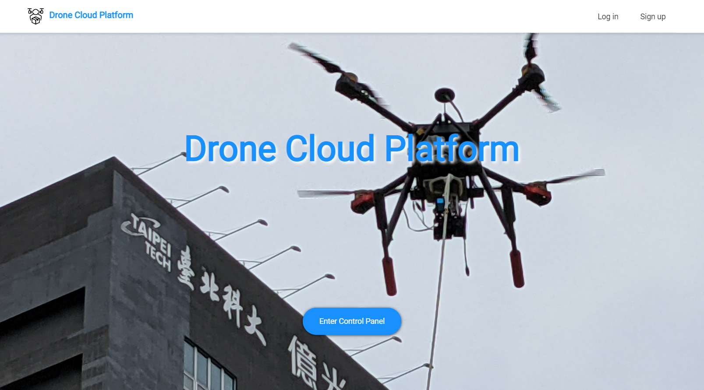
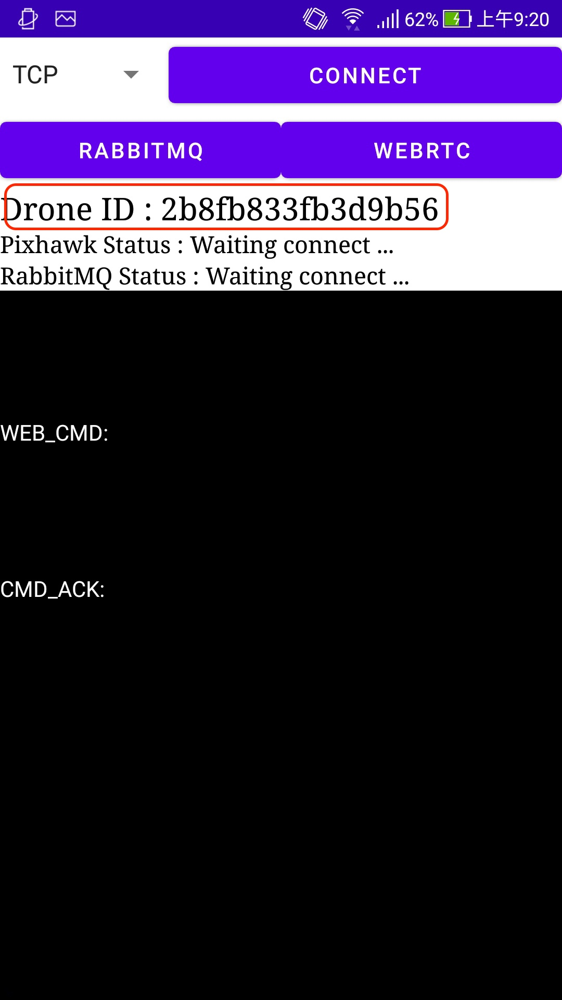
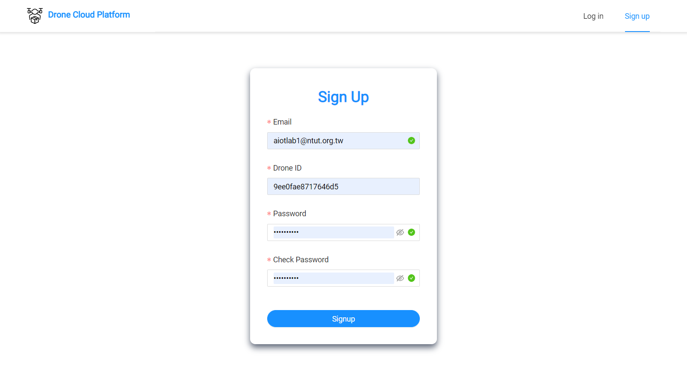

# Drone Cloud Platform




[Drone Cloud Platfrom](https://aiotlab-drone-cloud.web.app/) is a drone ground control system (GCS) build by Vue.js and it provide user to control there ardupilot-based drone through 4G network.

## Project setup

### Install Dependencies

```bash
npm install
```

### Config Environment Variables

Copy env example file and rename to `.env.local`

```bash
cp .env.local.example .env.local
```

Fill in credentials

```bash
VUE_APP_MAPBOX_TOKEN=your mapbox token
VUE_APP_BACKEND_SERVICE_PROTOCOL=http
VUE_APP_BACKEND_SERVICE_SERVICE_HOST=localhost
VUE_APP_BACKEND_SERVICE_SERVICE_PORT=3030
```

_Generate mapbox token(free, no need credit card): [https://account.mapbox.com/access-tokens/create](https://account.mapbox.com/access-tokens/create)_

### Run project

```bash
npm run serve
```

_The server will now run on http://localhost:8080_

### Build project

```bash
npm run build
```

### Deployment

Initial firebase configs

```bash
firebase init
```

Deploy to firebase hosting

```bash
firebase deploy --only hosting
```

## Get started

### 1. Download the App

[Download the latest apk](https://github.com/waiting33118/AED-Rescue-Drone-Project-for-Android/releases)

### 2. Open the App to get **Drone ID**



### 3. Sign up account

- [Drone Cloud Platform Sign up](https://aiotlab-drone-cloud.web.app/signup)
- Enter your Drone ID that shows on your App when register account


