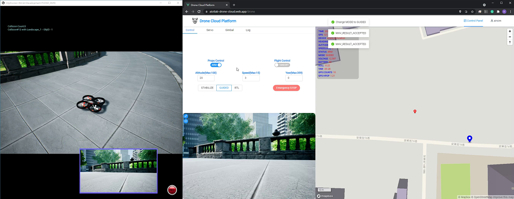

# AI Wings

AI Wings is an AIoT Drone System for commanding AIoT drone fleets via the 4G/5G network. We integrate ArduPilot with Android phones and endow DIY drones with AI computing power and 4G/5G connectiviy. AI Wings consists of a cloud server (node.js), Web UI (vue.js), onboard App (Android), and VR simulation (Unreal). Users can install our cloud server and create their own Internet of Drones. Our paper "[AI Wings: An AIoT Drone System for Commanding ArduPilot UAVs](https://ieeexplore.ieee.org/document/9836339)" has been published by IEEE Systems Journal.

## Real World Testing

All test videos in the real world can be found here:  
[www.youtube.com/playlist?list=PL3S3ZnDPwJ-MV5H1yTzR0jPp5sz-ptSo3](https://www.youtube.com/playlist?list=PL3S3ZnDPwJ-MV5H1yTzR0jPp5sz-ptSo3).

AI Wings System Test | AED Delivery Test
:-----------------------------------------:|:-------------------------------------------------------:
 | 
4G/5G Two-drones Control | VR Drone control
 | 

## Getting Started

The major steps to create your own AIoT drone fleet are:

### 1. Build Your own Drones

1. Assemble an ArduPilot-based drone. We recommend [Pixhawk AutoPilot](https://docs.px4.io/v1.9.0/en/getting_started/)

### 2. Install Onboard App
<a name="software"/>

1. Get an Android phone and install our Android control APP. Refer to our [esm-android page](onboard_app.md)
2. Connect APP to your server. (Bind your phone to the server if you are using multi-user server)
3. Attach the phone to the drone and connect it to Pixhawk MCU

### 3. Setup a Cloud Server
<a name="cloud"/>

1. Install our [cloud server](server.md).
2. Read the user's manual of [Web UI](web_ui.md)
3. Check the web UI to see if the drone appears on the map
4. Ready to fly! 

### VR Simulation

AI Wings supports Microsoft AirSim, which allows users to simulate drone functtions in VR worlds. The simulation video is shown below. The upper-left window is the VR world and lower-left window is the virtual camera view. The right window is the web UI of AI Wings.

## Software Development

The system architecture is shown as below.

This project is under active development and will be updated frequently.
