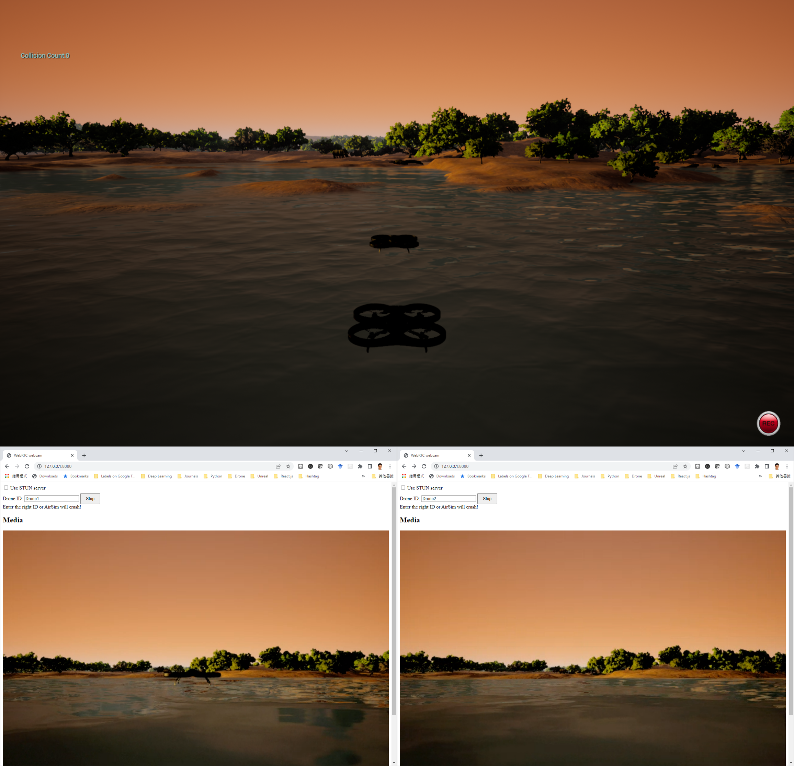

# Streaming video from AirSim using WebRTC

This Python example shows how to stream video from AirSim using AIORTC library (WebRTC). This code is modified from
AIORTC [server](https://github.com/aiortc/aiortc/tree/main/examples/server) 
and [videostream-cli](https://github.com/aiortc/aiortc/tree/main/examples/videostream-cli). A demo of two drones is shown below:

 

Two drones named "drone1" and "drone2" were created in AirSim pre-built environment "Africa". A Python web server is running to provide the WebRTC client. 
Open a webpage, enter the drone ID and connect to one drone. We use one web client for one drone. 


## Running the code

Install the prerequisite libraries:
```
pip install aiohttp aiortc opencv-python
pip install airsim
```

Run the server
```
python server.py
```

Open your server's homepage at
https://127.0.0.1:8080.

## Running AirSim Environment

Run an AirSim environment and create drones with names. You can download the pre-compiled environments [here](https://github.com/Microsoft/AirSim/releases). An example of JSON setting file that creates 2 drones is [settings_two_drones.json](./settings_two_drones.json).


## Connecting to the drones 

Back to your webpage, enter the drone's ID and click "start" button. You will see the video of the drone after few seconds. Make sure you enter the correct ID of the drone, or AirSim will crash.
